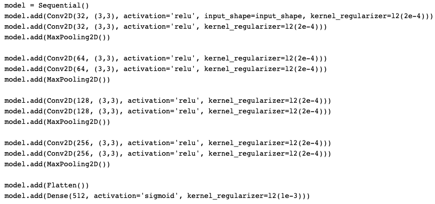
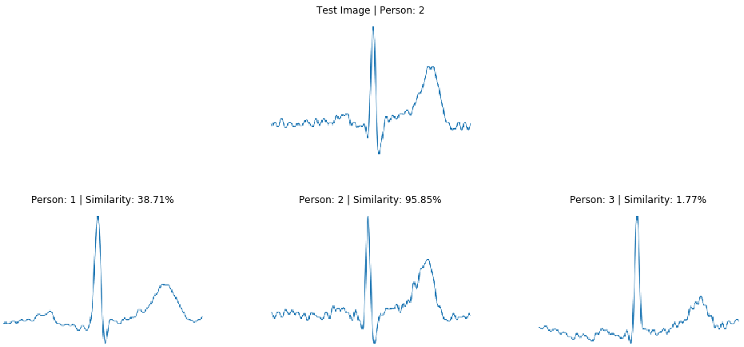
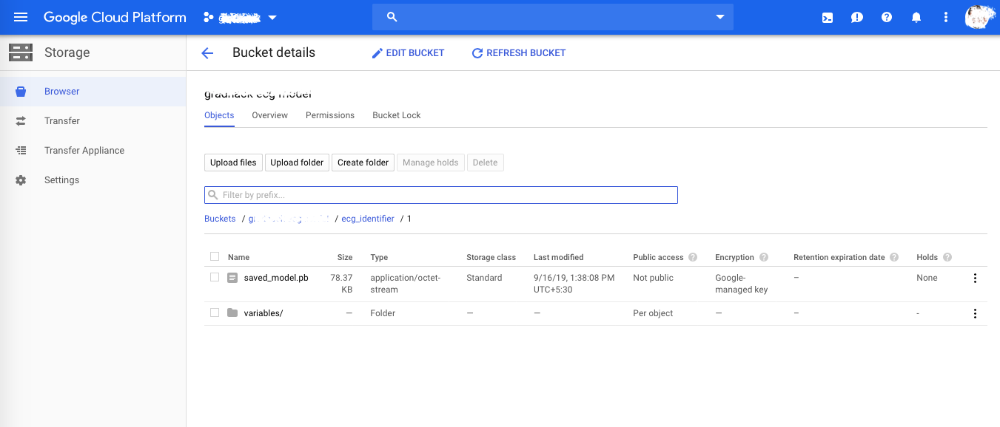
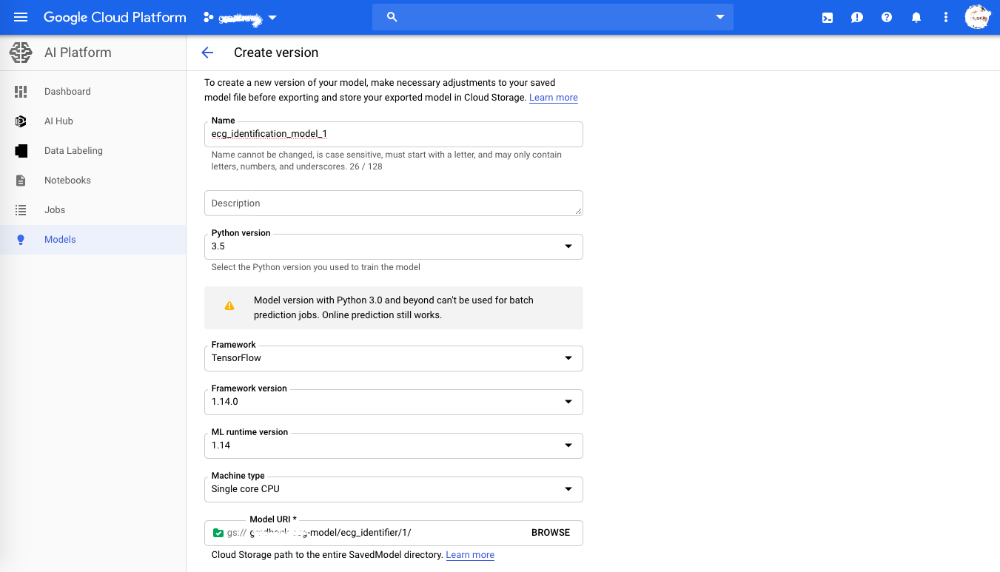
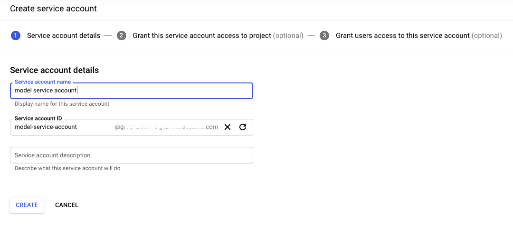
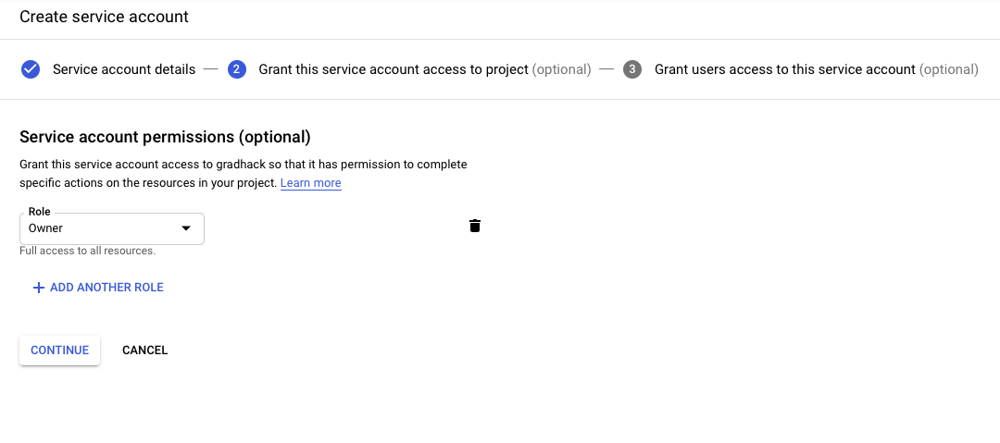
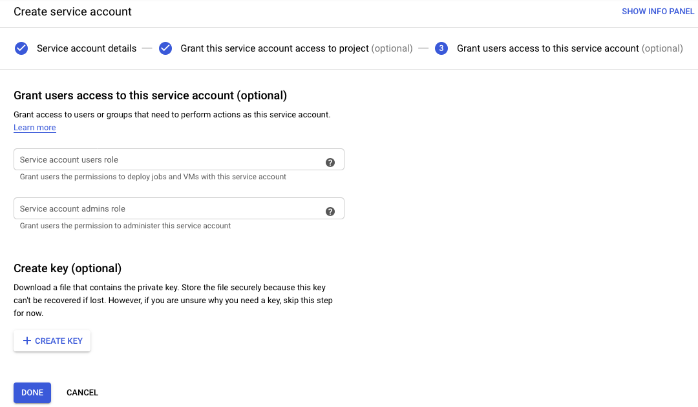

The amount of data each individual produces today is mind-boggling. In fact, in the past 2–3 years, we have generated around 90% of the total world data [1]. Surprising? But this ain’t enough. In the age of Big Data and IoT, this is going to increase manifold in the coming years. One of the biggest downsides that come with this data explosion is its security. According to the Verizon Data Breach Investigations Report [2],

> over 70% of employees reuse passwords at work. And also, “81% of hacking-related breaches leveraged either stolen and/or weak passwords.”

So, What is the solution?
Well, a lot of fingerprints, facial recognition, iris, voice, and even vein recognition technologies are continuing to gain ground, with commercial applications being developed for each. We can say that it’s the future for biometric authentication systems. They remove the burden of remembering long passwords or pins and instead uses the inherent traits of individuals which are hard to replicate, but not impossible.
Fingerprints can be fooled from gel or latex fingers, faceID can be cracked from photographs and iris scanners can be falsified by contact lenses. Well, nothing is secured if you look in that way. Let’s try something new, What about ECG?

## Electrocardiogram

ECG is the depiction of the electric signals that come from the expansion and contraction of heart muscles, indirectly the flow of blood inside the heart. It depends on the anatomy and physiology of the heart which can vary with age, gender and myriad of other factors. And the most fascinating part is that it doesn’t change over time for an individual, not even when the heart beats increase or decrease. Here are some of the key advantages of using ECG as a biometric [3].

- ECG is an internal biometric and therefore cannot be easily forged without the knowledge of the subject.
- Since the signals are continuous, ECG also enables liveness detection which can be used by security systems.
- The signals are not affected by environmental changes and surroundings like lighting conditions in face detection and background noise in voice recognition etc.
- ECG signal can be captured via various conductive materials like smartwatches, smart vests, and other fitness devices.
- Allows for the possibility of reading the individual beyond authentication, like the ability to give real-time insight into their wellness state, mood, emotion, etc.

There are a very few implementations or white papers on ECG for authentication as it’s still in its incipient stages. A few of them are listed in the references section. Do check them out.

Apart from authentication, ECG can be used in the detection of various heart-related complications as well, like enlargement of the heart, abnormal rhythm (arrhythmia), heart inflammation (pericarditis or myocarditis), cardiac arrest and so on. Check out this detailed blog from Intel on how AI will be taking over the Healthcare market.

Now that the theoretical concept is clear, let’s move on to some hands-on. The next part of this blog post will focus on the implementation of the ECG biometric authentication using Deep Learning on Intel® AI DevCloud.

## Data

The ECG waves are divided into 3 major parts: P, QRS complex, and T. They represent the peaks in the signal and contain the majority of information. The features include the amplitude of the peaks and the time difference between them.

<a href="" class="image"></a>

For this task, ECG-ID Database was used which contains 310 ECG signals from 90 different people. The number of recordings for each person varies from 2 to 20 and contains raw and filtered signals (without noise).
We’ll use deep learning for this task and therefore don’t need to provide the features explicitly, rather, we’ll use the images of the ECG signals to train a Siamese network and differentiate between them. Where are the images? Let’s create them.

```
def segmentation(filename):
    """ Gets the ECG segment (wave) and saves to image """
    
    # reads raw signal (ECG I)
    record = wfdb.rdsamp(filename)
    # get the first column signal
    data = record[0][:,1]
    signals = []
    count = 1

    # apply Christov Segmenter to get separate waves
    peaks =  biosppy.signals.ecg.christov_segmenter(signal=data, sampling_rate=record[1]['fs'])[0]
    for i in (peaks[1:-1]):
        diff1 = abs(peaks[count - 1] - i)
        diff2 = abs(peaks[count + 1] - i)
        x = peaks[count - 1] + diff1//2
        y = peaks[count + 1] - diff2//2
        signal = data[x:y]
        signals.append(signal)
        count += 1
                        
    # save the waves as the images
    for signal in signals:
        save_fig(signal)
```
The code for segmenting the continuous ECG signals.


When we read signal from the files, it comes like a continuous wave (represented in the diagram above). So our first step will be to segment these continuous waves into the individual samples, representing just one wave. This is done through the Christov Segmenter.

<a href="" class="image"></a>

Single ECG wave segmented from the continuous signal.

These individual signals thus segmented are then plotted and saved using matplotlib. For all 90 different people, 50–100 such images were created, making the total of around 6000 images (on average 65 per person).
The data is read through a Data Loader which returns the pair of half similar and half different ECG images, randomly from the complete dataset. We will use single-channel images with the size of 144x224 for training.

```
for i in range(batch_size):
    # select random person
    idx_1, idx_2 = np.random.choice(self.train_set, 2, replace=False).tolist()
    # select random ecg sample of the person
    pair_x, pair_y = np.random.choice(self.file_set[idx_1-1], 2, replace=False).tolist()

    # load and format the image
    img = Image.open(pair_x)
    img = img.resize((h, w))
    pairs[0][i,:,:,:] = np.array(img)[:,:,0:1] / 255

    #pick images of same class for 1st half, different for 2nd
    if i < batch_size // 2:
        pair_y = np.random.choice(self.file_set[idx_2-1], 1, replace=False)[0]

    img = Image.open(pair_y)
    img = img.resize((h, w))
    pairs[1][i,:,:,:] = np.array(img)[:,:,0:1] / 255

return pairs, targets
```
The code for generating the training batch pairs.

## Siamese Network

The word Siamese literally translates to conjoined twins. In deep learning, these networks are used to find the similarity between two objects (images in our case). Usually, the images are passed through a series of convolutions to get their fixed-sized encoded representation. For a fully trained network, if the images are similar, they are going to give a very similar encoded representation and vice versa. By looking at the differences in these encodings, the inputs can be verified. This is the central idea behind the Siamese Networks.

<a href="" class="image"></a>
Siamese model architecture [reference].

Here, we have created a convolutional neural network as our model. More details about which can be found on my GitHub repository.

## Training

The model training was done on Intel® AI DevCloud. It is a cluster of Intel® Xeon® Scalable Processors that will assist you with your compute needs in training and inferencing ML models. Along with the compute power, it also provides access to the precompiled software optimized for Intel® architecture. For more information, I would suggest you to go over to the [this](https://medium.com/intel-student-ambassadors/getting-started-with-intel-ai-devcloud-348a88b29eb9) article.

It took around 3000 iterations to reach the average person-wise validation accuracy of around 85%. Further tweaking of model architecture and training for a long time can surely improve the model. I will leave that to you for now and head on to the deployment.

<a href="" class="image"></a>
Figure showing the confidence in recognizing the valid person’s ECG.

## Deployment

We are going to use Google Cloud’s AI Platform (ML Engine) for the model deployment. AI Platform helps developers to work on their ML projects from ideation to production and deployment, quickly and cost-effectively. It supports Kubeflow, Google’s open-source platform, which lets you build portable ML pipelines that you can run on-premises or on Google Cloud without significant code changes. And you’ll have access to cutting-edge Google AI technology like TensorFlow, TPUs, and TFX tools as you deploy your AI applications to production [4].
You will need to have a Google Cloud account for this section, if you don’t have or don’t want to create one, you can even access the model locally. Follow the steps below for the further process [5].

### Step 1
The first step is to convert the Keras model to a TensorFlow saved model format using the code given below.

```
import tensorflow as tf

# The export path contains the name and the version of the model
tf.keras.backend.set_learning_phase(0)  # Ignore dropout at inference
model = tf.keras.models.load_model('model_ecg.h5')
export_path = 'ecg_identifier/1'

# Fetch the Keras session and save the model
# The signature definition is defined by the input and output tensors
# And stored with the default serving key
with tf.keras.backend.get_session() as sess:
    tf.saved_model.simple_save(
        sess,
        export_path,
        inputs={t.name: t for t in model.inputs},
        outputs={t.name: t for t in model.outputs})
```
The code to convert Keras model to TensorFlow saved model format.

This saved model will receive requests containing the two images which you want to verify and will return an output between 0 and 1, representing the probability of them belonging to the same person.

### Step 2
Create a storage bucket and upload your saved model folder inside it. During inference, the model graph and weights are loaded from here.

<a href="" class="image"></a>
Model files stored in the Google Storage Bucket.

### Step 3
Head over to the AI Platform -> Models and create a new model for your project. Inside the model, create a new version.

<a href="" class="image"></a>
New model version on the AI platform.

Check the version of python and TensorFlow in your development environment and provide those details while creating the new model version. In the model URI, give the path of the folder where the saved_model.pb is located. When the model version gets the request, it hits the URI and runs the model for the output. Keep the rest of the options as default and create the version.

### Step 4
For accessing the service, you need to create a service account [6]. To do this, go to this link -> select a project -> click on CREATE SERVICE ACCOUNT button.

Give any service account name, select the role as project owner and then create a .json key. This will generate a key pair and download it to your computer. Note down the path of the file just downloaded as we’ll be requiring it during the inference.

<a href="" class="image"></a>
<a href="" class="image"></a>
<a href="" class="image"></a>

### Step 5
The final step is to query the model thus hosted. We will use the GoogleApiClient python API for this purpose.

```
import os
from googleapiclient import discovery

# set the service-account json key path to your environment
os.environ['GOOGLE_APPLICATION_CREDENTIALS'] = 'path-to-your-json-key'
# define the model verison hosted on the AI platform
name = 'projects/{}/models/{}/versions/{}'.format('your-project-name', 'your-model-name', 'your-version-name')

# create the input request
instances = [{'input_1:0': img1.tolist(), 'input_2:0': img2.tolist()}]
service = discovery.build('ml', 'v1')

# send the request to the model
response = service.projects().predict(
    name=name,
    body={'instances': instances}
).execute()

# receiving the predictions
if 'error' in response:
    raise RuntimeError(response['error'])
else:
    pred = response['predictions'][0]['dense_1/Sigmoid:0'][0]
    print("Similarity between two images: {:.2f}%".format(pred*100))
```
The code to inference the model hosted on GCP

We need to define a few parameters to recognize the model we are querying. They are project, model, and version name. Also, we need to set an environment variable to point to the credentials file (service account key). Fill these details accordingly.

The last part is to create the request which will consist of the two input images. They have to be defined in the json format with the keys as the layer names in the Keras model. They will usually be input_1:0 and input_2:0 but do confirm if you are not able to get the results. Follow the code snippet given above to inference the model and you’ll be good to go.

## Conclusion

Pheeewww!! That was a lot of information right? Let’s summarize what we have discussed. We started with the idea of using a person’s electrocardiogram as a means of authentication, as it is unique to an individual and has a lot of advantages over the other methods. Then we went through a public ECG database and prepared the image data consisting of segmented ECG waves of 90 different people. A Siamese model was trained on this data to get the similarity between the two input images and verify the user’s identity. The trained model was finally deployed on the Google Cloud Platform and then we saw how to inference it using the python API.

I hope this article instills the idea of using a new way of authentication which hasn’t been explored much. Feel free to share your doubts or findings in the comment section. Also, do check out the GitHub repository for the complete code. Thanks!

## References

1. https://www.forbes.com/sites/bernardmarr/2018/05/21/how-much-data-do-we-create-every-day-the-mind-blowing-stats-everyone-should-read/#29b554e960ba
2. https://www.tracesecurity.com/blog/articles/81-of-company-data-breaches-due-to-poor-passwords
3. https://www.sciencedirect.com/science/article/pii/S0969476518300110?via%3Dihub
4. https://cloud.google.com/ai-platform/
5. https://cloud.google.com/ml-engine/docs/deploying-models
6. https://cloud.google.com/iam/docs/creating-managing-service-accounts

ECG Authentication Resources
7. https://www.hindawi.com/journals/wcmc/2019/6458719/
8. https://ieeexplore.ieee.org/abstract/document/8192201/
9. https://ieeexplore.ieee.org/abstract/document/7348372
10. https://ieeexplore.ieee.org/abstract/document/7933065
11. https://ieeexplore.ieee.org/abstract/document/8095063
