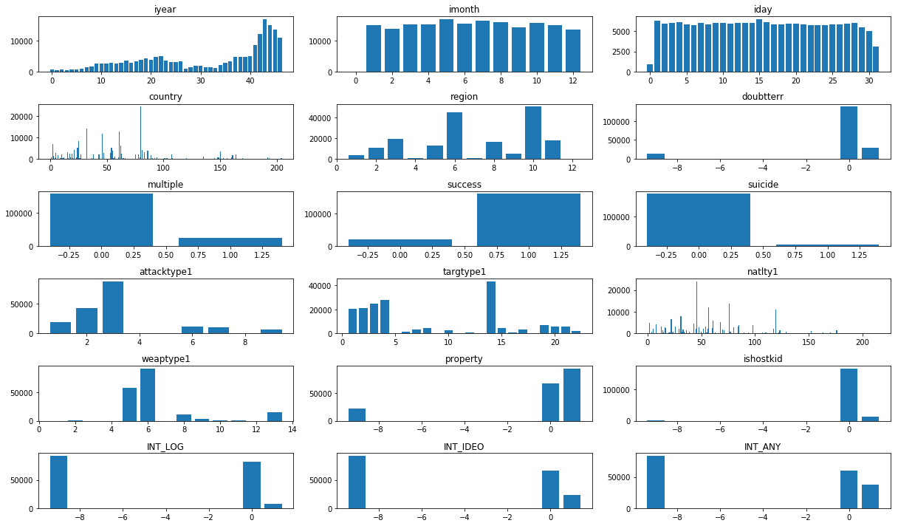
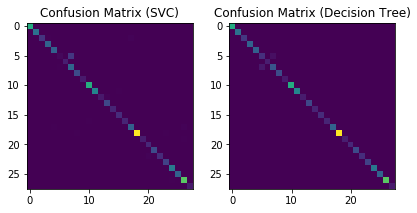

Here [Global Terrorism Database (GTD)](http://www.start.umd.edu/gtd/) is used to classify the Terrorist Group which might be involved in an attack based on number of kills, region, weapons used etc.

The tutorial contains a jupyter notebook, which is used to preprocess the data and classify the Terrorist Groups using Machine Learning techniques like Support Vector Machine and Decision Tree with accuracies of 96.55% and 98.27% respectively.

The input and labels of the model are stored in the [x_normed.npy](https://github.com/amanbasu/Global-Terrorist-Attack-Classification/blob/master/x_normed.npy) and [y.npy](https://github.com/amanbasu/Global-Terrorist-Attack-Classification/blob/master/y.npy) files respectively.

Further details about the Database can be found in [Codebook.pdf](https://github.com/amanbasu/Global-Terrorist-Attack-Classification/blob/master/Codebook.pdf) file.


```python
import pandas as pd
import numpy as np
import pickle, gzip
import matplotlib.pyplot as plt
from sklearn import svm
from sklearn.metrics import confusion_matrix, precision_recall_fscore_support
from sklearn.tree import DecisionTreeClassifier
from sklearn.preprocessing import MinMaxScaler
from sklearn.model_selection import train_test_split
```

# Removing NA values

```python
df = pd.read_excel('globalterrorismdb_0718dist.xlsx') # reading all data
df.shape
```
    (181691, 135)


```python
df.head()
```
<div>
<table border="1" class="dataframe">
  <thead>
    <tr style="text-align: right;">
      <th></th>
      <th>iyear</th>
      <th>imonth</th>
      <th>iday</th>
      <th>approxdate</th>
      <th>extended</th>
      <th>resolution</th>
      <th>country</th>
      <th>...</th>
      <th>dbsource</th>
      <th>INT_LOG</th>
      <th>INT_IDEO</th>
      <th>INT_MISC</th>
      <th>INT_ANY</th>
      <th>related</th>
    </tr>
  </thead>
  <tbody>
    <tr>
      <th>0</th>
      <td>1970</td>
      <td>7</td>
      <td>2</td>
      <td>NaN</td>
      <td>0</td>
      <td>NaT</td>
      <td>58</td>
      <td>...</td>
      <td>PGIS</td>
      <td>0</td>
      <td>0</td>
      <td>0</td>
      <td>0</td>
      <td>NaN</td>
    </tr>
    <tr>
      <th>1</th>
      <td>1970</td>
      <td>0</td>
      <td>0</td>
      <td>NaN</td>
      <td>0</td>
      <td>NaT</td>
      <td>130</td>
      <td>...</td>
      <td>PGIS</td>
      <td>0</td>
      <td>1</td>
      <td>1</td>
      <td>1</td>
      <td>NaN</td>
    </tr>
    <tr>
      <th>2</th>
      <td>1970</td>
      <td>1</td>
      <td>0</td>
      <td>NaN</td>
      <td>0</td>
      <td>NaT</td>
      <td>160</td>
      <td>...</td>
      <td>PGIS</td>
      <td>-9</td>
      <td>-9</td>
      <td>1</td>
      <td>1</td>
      <td>NaN</td>
    </tr>
    <tr>
      <th>3</th>
      <td>1970</td>
      <td>1</td>
      <td>0</td>
      <td>NaN</td>
      <td>0</td>
      <td>NaT</td>
      <td>78</td>
      <td>...</td>
      <td>PGIS</td>
      <td>-9</td>
      <td>-9</td>
      <td>1</td>
      <td>1</td>
      <td>NaN</td>
    </tr>
    <tr>
      <th>4</th>
      <td>1970</td>
      <td>1</td>
      <td>0</td>
      <td>NaN</td>
      <td>0</td>
      <td>NaT</td>
      <td>101</td>
      <td>...</td>
      <td>PGIS</td>
      <td>-9</td>
      <td>-9</td>
      <td>1</td>
      <td>1</td>
      <td>NaN</td>
    </tr>
  </tbody>
</table>
<p>5 rows × 135 columns</p>
</div>

```python
df.isnull().any()  # checking columns with null value
```

    eventid               False
    iyear                 False
    imonth                False
    iday                  False
    approxdate             True
    extended              False
    resolution             True
    country               False
                          ...  
    propextent             True
    propextent_txt         True
    propvalue              True
    propcomment            True
    ishostkid              True
    nhostkid               True
    nhostkidus             True
    nhours                 True
    INT_MISC              False
    INT_ANY               False
    related                True
    Length: 135, dtype: bool

```python
# To remove all columns having null values > 5000
for i in df.columns:
    if df[i].isnull().sum()>5000:
        df.drop(columns=i, inplace=True)
df.shape
```
    (181691, 41)

```python
# further reduction of unnecessary columns after looking at the Codebook (documentation)
df.drop(columns=['eventid', 'extended', 'country_txt', 'region_txt', 'specificity', 'vicinity',
                 'crit1', 'crit2', 'crit3', 'attacktype1_txt', 'targtype1_txt', 'natlty1_txt',
                 'guncertain1', 'individual', 'weaptype1_txt', 'dbsource', 'INT_MISC'], inplace=True)
df.shape
```
    (181691, 24)

```python
# saving file for future use
df.to_csv('terrorist_data_pruned.csv', index=False)
```

# Filling NA values

```python
df2 = pd.read_csv('terrorist_data_pruned.csv')
df2.head()
```
<div>
<table border="1" class="dataframe">
  <thead>
    <tr style="text-align: right;">
      <th></th>
      <th>iyear</th>
      <th>imonth</th>
      <th>iday</th>
      <th>country</th>
      <th>region</th>
      <th>provstate</th>
      <th>city</th>
      <th>latitude</th>
      <th>...</th>
      <th>natlty1</th>
      <th>gname</th>
      <th>weaptype1</th>
      <th>property</th>
      <th>ishostkid</th>
      <th>INT_LOG</th>
    </tr>
  </thead>
  <tbody>
    <tr>
      <th>0</th>
      <td>1970</td>
      <td>7</td>
      <td>2</td>
      <td>58</td>
      <td>2</td>
      <td>-1</td>
      <td>Santo Domingo</td>
      <td>18.456792</td>
      <td>...</td>
      <td>58.0</td>
      <td>MANO-D</td>
      <td>13</td>
      <td>0</td>
      <td>0.0</td>
      <td>0</td>
    </tr>
    <tr>
      <th>1</th>
      <td>1970</td>
      <td>0</td>
      <td>0</td>
      <td>130</td>
      <td>1</td>
      <td>0</td>
      <td>Mexico city</td>
      <td>19.371887</td>
      <td>...</td>
      <td>21.0</td>
      <td>23rd of September Communist League</td>
      <td>13</td>
      <td>0</td>
      <td>1.0</td>
      <td>0</td>
    </tr>
    <tr>
      <th>2</th>
      <td>1970</td>
      <td>1</td>
      <td>0</td>
      <td>160</td>
      <td>5</td>
      <td>1</td>
      <td>Unknown</td>
      <td>15.478598</td>
      <td>...</td>
      <td>217.0</td>
      <td>Unknown</td>
      <td>13</td>
      <td>0</td>
      <td>0.0</td>
      <td>-9</td>
    </tr>
    <tr>
      <th>3</th>
      <td>1970</td>
      <td>1</td>
      <td>0</td>
      <td>78</td>
      <td>8</td>
      <td>2</td>
      <td>Athens</td>
      <td>37.997490</td>
      <td>...</td>
      <td>217.0</td>
      <td>Unknown</td>
      <td>6</td>
      <td>1</td>
      <td>0.0</td>
      <td>-9</td>
    </tr>
    <tr>
      <th>4</th>
      <td>1970</td>
      <td>1</td>
      <td>0</td>
      <td>101</td>
      <td>4</td>
      <td>3</td>
      <td>Fukouka</td>
      <td>33.580412</td>
      <td>...</td>
      <td>217.0</td>
      <td>Unknown</td>
      <td>8</td>
      <td>1</td>
      <td>0.0</td>
      <td>-9</td>
    </tr>
  </tbody>
</table>
<p>5 rows × 24 columns</p>
</div>

```python
# replacing nan values (refer Codebook.pdf)
df2['doubtterr'].fillna(-9, inplace=True)
df2['multiple'].fillna(0, inplace=True)
df2['natlty1'].fillna(0, inplace=True)
df2['ishostkid'].fillna(-9, inplace=True)
df2['latitude'].fillna(0, inplace=True)
df2['longitude'].fillna(0, inplace=True)

# quantizing dataset
df2['provstate'] = pd.factorize(df2['provstate'])[0]
df2['iyear'] = pd.factorize(df2['iyear'])[0]
df2['city'] = pd.factorize(df2['city'])[0]
df2['country'] = pd.factorize(df2['country'])[0]
df2['target1'] = pd.factorize(df2['target1'])[0]
df2['gname'] = pd.factorize(df2['gname'])[0]
df2['natlty1'] = pd.factorize(df2['natlty1'])[0]

df2.isna().any()
```
    iyear          False
    imonth         False
    iday           False
    country        False
    region         False
    provstate      False
    city           False
    latitude       False
    longitude      False
    doubtterr      False
    multiple       False
    success        False
    suicide        False
    attacktype1    False
    targtype1      False
    target1        False
    natlty1        False
    gname          False
    weaptype1      False
    property       False
    ishostkid      False
    INT_LOG        False
    INT_IDEO       False
    INT_ANY        False
    dtype: bool

```python
# saving file for future use
df2.to_csv('terrorist_data_pruned.csv', index=False)
```

# Normalizing Columns

```python
df = pd.read_csv('terrorist_data_pruned.csv')
df.head()
```
<div>
<table border="1" class="dataframe">
  <thead>
    <tr style="text-align: right;">
      <th></th>
      <th>iyear</th>
      <th>imonth</th>
      <th>iday</th>
      <th>country</th>
      <th>region</th>
      <th>provstate</th>
      <th>city</th>
      <th>latitude</th>
      <th>...</th>
      <th>natlty1</th>
      <th>gname</th>
      <th>weaptype1</th>
      <th>property</th>
      <th>ishostkid</th>
      <th>INT_LOG</th>
    </tr>
  </thead>
  <tbody>
    <tr>
      <th>0</th>
      <td>0</td>
      <td>7</td>
      <td>2</td>
      <td>0</td>
      <td>2</td>
      <td>0</td>
      <td>0</td>
      <td>18.456792</td>
      <td>...</td>
      <td>0</td>
      <td>0</td>
      <td>13</td>
      <td>0</td>
      <td>0.0</td>
      <td>0</td>
    </tr>
    <tr>
      <th>1</th>
      <td>0</td>
      <td>0</td>
      <td>0</td>
      <td>1</td>
      <td>1</td>
      <td>1</td>
      <td>1</td>
      <td>19.371887</td>
      <td>...</td>
      <td>1</td>
      <td>1</td>
      <td>13</td>
      <td>0</td>
      <td>1.0</td>
      <td>0</td>
    </tr>
    <tr>
      <th>2</th>
      <td>0</td>
      <td>1</td>
      <td>0</td>
      <td>2</td>
      <td>5</td>
      <td>2</td>
      <td>2</td>
      <td>15.478598</td>
      <td>...</td>
      <td>2</td>
      <td>2</td>
      <td>13</td>
      <td>0</td>
      <td>0.0</td>
      <td>-9</td>
    </tr>
    <tr>
      <th>3</th>
      <td>0</td>
      <td>1</td>
      <td>0</td>
      <td>3</td>
      <td>8</td>
      <td>3</td>
      <td>3</td>
      <td>37.997490</td>
      <td>...</td>
      <td>2</td>
      <td>2</td>
      <td>6</td>
      <td>1</td>
      <td>0.0</td>
      <td>-9</td>
    </tr>
    <tr>
      <th>4</th>
      <td>0</td>
      <td>1</td>
      <td>0</td>
      <td>4</td>
      <td>4</td>
      <td>4</td>
      <td>4</td>
      <td>33.580412</td>
      <td>...</td>
      <td>2</td>
      <td>2</td>
      <td>8</td>
      <td>1</td>
      <td>0.0</td>
      <td>-9</td>
    </tr>
  </tbody>
</table>
<p>5 rows × 24 columns</p>
</div>

```python
# checking frequency of column values
plt.figure(figsize=(17,10))
i = 0
for col in df.columns:
    if col=='latitude' or col=='longitude' or col=='city' or col=='provstate' or col=='target1' or col=='gname':
        continue
    i += 1
    plt.subplot(6, 3, i)
    num_list = df[col].value_counts()
    plt.bar(num_list.index, num_list.values)
    plt.title(col)
plt.tight_layout()   
plt.show()
```

<div style="text-align:center">
  <a href="" class="image"></a><br>
</div>


```python
# classes having less than 600 samples were dropped from the dataframe to remove skewedness in data
num = df['gname'].value_counts()
res = num.where(num>600).dropna()
res
```
    2       82782.0
    2001     7478.0
    3024     5613.0
    455      4555.0
    478      3351.0
    2699     3288.0
    15       2772.0
    46       2671.0
    203      2487.0
    2819     2418.0
    1057     2310.0
    78       2024.0
    2589     1878.0
    631      1630.0
    221      1606.0
    123      1561.0
    2695     1351.0
    36       1125.0
    2632     1062.0
    2549     1020.0
    948       895.0
    1019      830.0
    863       716.0
    157       639.0
    2526      638.0
    598       632.0
    3136      624.0
    281       607.0
    Name: gname, dtype: float64

```python
k = []
c = 0
for index, row in df.iterrows():
    if row['gname'] not in list(res.index):
        k.append(index)
    if row['gname']==2:
        c += 1
        if c>5000:
            k.append(index)

df.drop(index=k, inplace=True)
df.shape
```
    (60781, 24)


```python
# converts labels to one-hot encoding
y = pd.get_dummies(df['gname']).values
y.shape
```
    (60781, 28)

```python
# normalizing feature values
x = df.drop(columns='gname')
x = x.values
min_max_scaler = MinMaxScaler()
x_scaled = min_max_scaler.fit_transform(x)
df2 = pd.DataFrame(x_scaled)

x_scaled.shape
```
    (60781, 23)

```python
df2.head()
```
<div>
<table border="1" class="dataframe">
  <thead>
    <tr style="text-align: right;">
      <th></th>
      <th>0</th>
      <th>1</th>
      <th>2</th>
      <th>3</th>
      <th>4</th>
      <th>5</th>
      <th>6</th>
      <th>7</th>
      <th>...</th>
      <th>17</th>
      <th>18</th>
      <th>19</th>
      <th>20</th>
      <th>21</th>
      <th>22</th>
    </tr>
  </thead>
  <tbody>
    <tr>
      <th>0</th>
      <td>0.0</td>
      <td>0.083333</td>
      <td>0.000000</td>
      <td>0.010</td>
      <td>0.363636</td>
      <td>0.000708</td>
      <td>0.000082</td>
      <td>0.572701</td>
      <td>...</td>
      <td>1.000000</td>
      <td>0.9</td>
      <td>0.9</td>
      <td>0.0</td>
      <td>0.0</td>
      <td>1.0</td>
    </tr>
    <tr>
      <th>1</th>
      <td>0.0</td>
      <td>0.083333</td>
      <td>0.000000</td>
      <td>0.015</td>
      <td>0.636364</td>
      <td>0.001062</td>
      <td>0.000109</td>
      <td>0.782926</td>
      <td>...</td>
      <td>0.363636</td>
      <td>1.0</td>
      <td>0.9</td>
      <td>0.0</td>
      <td>0.0</td>
      <td>1.0</td>
    </tr>
    <tr>
      <th>2</th>
      <td>0.0</td>
      <td>0.083333</td>
      <td>0.000000</td>
      <td>0.020</td>
      <td>0.272727</td>
      <td>0.001416</td>
      <td>0.000136</td>
      <td>0.741690</td>
      <td>...</td>
      <td>0.545455</td>
      <td>1.0</td>
      <td>0.9</td>
      <td>0.0</td>
      <td>0.0</td>
      <td>1.0</td>
    </tr>
    <tr>
      <th>3</th>
      <td>0.0</td>
      <td>0.083333</td>
      <td>0.064516</td>
      <td>0.025</td>
      <td>0.000000</td>
      <td>0.002478</td>
      <td>0.000218</td>
      <td>0.781007</td>
      <td>...</td>
      <td>0.363636</td>
      <td>1.0</td>
      <td>0.9</td>
      <td>0.0</td>
      <td>0.0</td>
      <td>0.0</td>
    </tr>
    <tr>
      <th>4</th>
      <td>0.0</td>
      <td>0.083333</td>
      <td>0.258065</td>
      <td>0.035</td>
      <td>0.636364</td>
      <td>0.003540</td>
      <td>0.000327</td>
      <td>0.819274</td>
      <td>...</td>
      <td>0.272727</td>
      <td>0.9</td>
      <td>0.9</td>
      <td>0.0</td>
      <td>0.0</td>
      <td>1.0</td>
    </tr>
  </tbody>
</table>
<p>5 rows × 23 columns</p>
</div>


```python
# saving file for future use
np.save('x_normed.npy', x_scaled)
np.save('y.npy', y)
```

# Classification

```python
x = np.load('x_normed.npy')
y = np.load('y.npy')

x_train, x_test, y_train, y_test = train_test_split(x, y, test_size=0.1, random_state=0)
print(x_train.shape, y_train.shape, x_test.shape, y_test.shape)
```
    (54702, 23) (54702, 28) (6079, 23) (6079, 28)

```python
model1 = svm.SVC(C=5, kernel='rbf')
model2 = DecisionTreeClassifier()
```

```python
model1.fit(x_train, np.argmax(y_train, axis=1))
```
    SVC(C=5, cache_size=200, class_weight=None, coef0=0.0,
      decision_function_shape='ovr', degree=3, gamma='auto', kernel='rbf',
      max_iter=-1, probability=False, random_state=None, shrinking=True,
      tol=0.001, verbose=False)

```python
model2.fit(x_train, np.argmax(y_train, axis=1))
```

    DecisionTreeClassifier(class_weight=None, criterion='gini', max_depth=None,
                max_features=None, max_leaf_nodes=None,
                min_impurity_decrease=0.0, min_impurity_split=None,
                min_samples_leaf=1, min_samples_split=2,
                min_weight_fraction_leaf=0.0, presort=False, random_state=None,
                splitter='best')


```python
pred1 = model1.predict(x_test)
acc1 = np.mean(pred1==np.argmax(y_test, axis=1))*100

pred2 = model2.predict(x_test)
acc2 = np.mean(pred2==np.argmax(y_test, axis=1))*100

print('Accuracy SVC: {:.2f}%\nAccuracy Desicion Tree: {:.2f}%'.format(acc1, acc2))
```

    Accuracy SVC: 96.55%
    Accuracy Desicion Tree: 98.27%

```python
cm1 = confusion_matrix(np.argmax(y_test, axis=1), pred1)
cm2 = confusion_matrix(np.argmax(y_test, axis=1), pred2)

plt.subplot(1, 2, 1)
plt.imshow(cm1)
plt.title('Confusion Matrix (SVC)')

plt.subplot(1, 2, 2)
plt.imshow(cm2)
plt.title('Confusion Matrix (Decision Tree)')

plt.tight_layout()
plt.show()
```

<div style="text-align:center">
  <a href="" class="image"></a><br>
</div>

```python
pr1 = precision_recall_fscore_support(np.argmax(y_test, axis=1), pred1)
pr2 = precision_recall_fscore_support(np.argmax(y_test, axis=1), pred2)

print('SVC\nPrecision: {:.2f}%\nRecall: {:.2f}%\nF-score: {:.2f}%'.format(np.mean(pr1[0])*100, np.mean(pr1[1])*100, np.mean(pr1[2])*100))
print('\nDecision Tree\nPrecision: {:.2f}%\nRecall: {:.2f}%\nF-score: {:.2f}%'.format(np.mean(pr2[0])*100, np.mean(pr2[1])*100, np.mean(pr2[2])*100))
```

    SVC
    Precision: 96.12%
    Recall: 94.68%
    F-score: 94.52%
    
    Decision Tree
    Precision: 97.76%
    Recall: 97.95%
    F-score: 97.84%
